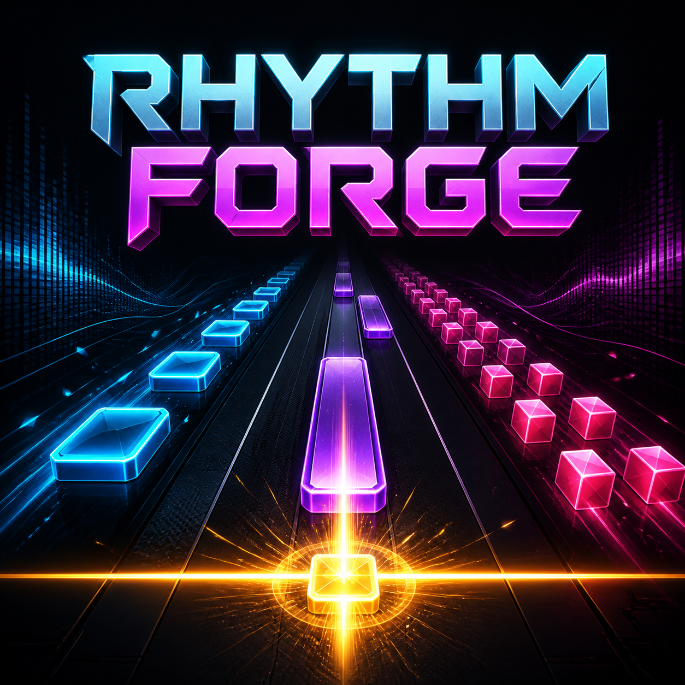

# Rhythm Forge



Rhythm Forge is an Omarchy bar extension and a one-key Linux rhythm game. Paste a music-video URL, let the game download a local 720p copy and detect its percussive onsets, then press **Space** when each note reaches the timing line.

The interface and all user-facing errors use American English.

## Requirements

- Omarchy 4.0 or newer (Quickshell plugin schema version 1)
- GTK 4 with Python GObject bindings (`gtk4`, `python-gobject`)
- Qt 6 QML and its FFmpeg multimedia backend (`qt6-declarative`, `qt6-multimedia`, `qt6-multimedia-ffmpeg`)
- `yt-dlp`, `ffmpeg`, and `ffprobe`
- A Nerd Font in the Omarchy bar (provided by the standard Omarchy setup)

Rhythm Forge needs the **Qt 6** QML runtime specifically. It looks for
`/usr/lib/qt6/bin/qml`, then `qml6`, then a `qml` on `PATH` that reports a 6.x
runtime — a system that also has `qt5-declarative` installed keeps the Qt 5
runtime at `/usr/bin/qml`, where it would otherwise shadow Qt 6. Set
`RHYTHM_FORGE_QT6_QML` to point at the runtime directly if Qt 6 lives in a
different prefix.

The standard Omarchy installation provides the Qt playback stack. Rhythm Forge does not run downloaded media as code. Any missing packages are offered through Omarchy's normal package helper only after explicit user action.

## Test without installing

```bash
./run.sh
```

## Install the Omarchy extension

```bash
omarchy plugin add https://github.com/itsVoid-TV/rhythm-forge.git --enable
```

Omarchy clones and validates the public plugin repository, installs it as `io.github.itsvoid-tv.rhythm-forge`, and enables it in the right bar section. For local development, `./install.sh` installs the current checkout and preserves an existing installation under `${XDG_STATE_HOME:-~/.local/state}/rhythm-forge/plugin-backups/`.

The marketplace installation never installs system packages silently. The bar widget checks all runtime dependencies before GTK is imported and changes to a warning icon when anything is missing. Clicking the warning shows an actionable Omarchy notification; clicking that notification opens the standard floating terminal and runs `omarchy-pkg-add` for only the missing packages. The user can inspect and cancel that normal package-manager flow.

Click the music-note icon in the Omarchy bar to start the game. The extension can also be opened through IPC:

```bash
omarchy-shell shell summon io.github.itsvoid-tv.rhythm-forge
```

## Controls

| Key | Action |
| --- | --- |
| Space, W, or Arrow Up | Hit a tap/SPAM note, or hold and release a HOLD note |
| P or Escape | Pause or resume |
| `[` / `]` | Move notes later / earlier in 10 ms steps |

The setup screen keeps up to five locally cached tracks under **Recently Played**. Selecting one starts it immediately without downloading or analyzing it again.

Timing calibration is stored separately for each track. Use `[` when notes arrive before the sound, or `]` when they arrive after it; the selected correction is restored the next time that song is played.

VSync is enabled by default and can be changed with the toggle in the game toolbar. With VSync on, note movement updates once per rendered frame; with it off, the game uses a 60 Hz timer.

Deliberate rapid tapping is allowed for dense passages. Extra taps between notes are counted for the result screen but do not damage score, combo, or accuracy. Only impossible duplicate events less than 20 ms apart and held-key auto-repeat are filtered.

Four or more tightly packed beats are combined into one readable **SPAM** block. Its segmented meter fills with every tap, and the block displays the required count directly. Extra physical taps before the block ends build an escalating, capped per-tap bonus while remaining unlimited in count. A sustained tone becomes a **HOLD** block: press as its leading edge reaches the timing line, keep the key held while the progress fill and percentage advance, then release near the trailing edge. HOLD ticks award small bonus points throughout the sustain. A 3–2–1 countdown runs after the video is ready, before audio and chart movement begin.

The chart analyzer uses separate percussion and vocal paths. Percussion drives ordinary TAP/SPAM notes, while a voice-band autocorrelation pass detects pitched syllable starts and stable sustained vowels independently of drum spacing. Its pitch tracking treats octave jumps as one continuous phrase, which keeps processed and rap vocals from fragmenting a held vowel. Long vocal phrases replace colliding percussion notes with one playable HOLD block, avoiding impossible one-key hold-and-tap overlaps. Existing cached songs are automatically reanalyzed once when the vocal-aware chart format changes.

## Stars, advancements, and styles

Every completed track receives a rating of up to 10 stars. The rating combines song length with accuracy; ratings below 50% earn no stars. A track awards the difference above its previous best rating, so improving a personal best earns the remaining stars without making replays an unlimited currency farm.

The song-selection screen contains separate **★ Shop** and **Inventory** buttons. Buy regular styles in the Shop, then equip any purchased or event-won style from Inventory. SPAM, HOLD, timing-line colors, and video-overlay background themes can be equipped independently. Every regular style costs 15 stars, while defaults remain free. The expanded catalog includes cyan, lime, gold, pink, purple, white, red, orange, and other category-specific choices. Background themes tint the video with a restrained gradient and grid without hiding it, preserving the original Rhythm Forge playfield. Lifetime stars, completed songs, event wins, advancement rank, owned styles, and equipped styles persist between sessions.

Before each song, the game independently rolls a 5% chance for a random event. If one appears, the song waits on an event card before the countdown. The card sets a score target of 100,000, 250,000, or 500,000 points according to chart length and previews an exclusive color or background reward. Winning permanently unlocks that style; event-exclusive styles cannot be bought in the shop.

Timing windows are ±70 ms for Perfect, ±130 ms for Great, and ±200 ms for Good.

## Privacy and storage

Rhythm Forge sends the pasted URL only to `yt-dlp` and the source site needed to retrieve the video. Videos and generated beat maps are cached under `${XDG_CACHE_HOME:-~/.cache}/rhythm-forge/`. No analytics or telemetry are collected.

Only download videos when you have permission to do so and when the source site's terms allow it.

## Runtime safety

- Every `yt-dlp`, `ffprobe`, and analysis `ffmpeg` process runs in its own process group with an absolute deadline. Timeout, cancellation, output-limit, and parser failures terminate the complete group and reap its leader.
- Metadata, logs, individual output lines, FFmpeg diagnostics, decoded PCM, and media duration all have explicit ceilings. The duration read from the downloaded file must be finite, positive, and no longer than 20 minutes even when remote metadata claimed otherwise.
- Percussion PCM is reduced into feature frames while it streams. Voice PCM is streamed into a size-limited temporary file and analyzed in two bounded passes, so neither FFmpeg pipe is accumulated without a limit in memory.
- Remote title, artist, and decoder-error text is normalized and length-limited before storage or command-line use. QML renders those values explicitly as `Text.PlainText`.

## Development

```bash
./build.sh
```

This runs the unit tests, Python and shell syntax checks, the native `omarchy plugin validate` command, and produces a versioned tarball plus SHA-256 checksum in `dist/`.

## Uninstall

```bash
omarchy plugin remove io.github.itsvoid-tv.rhythm-forge
```

The local-development `./uninstall.sh` path is recoverable: it disables the plugin and moves it into the XDG state backup directory. Cached videos are deliberately left untouched by either removal method.

## License

GPL-3.0-or-later. See `LICENSE`.
